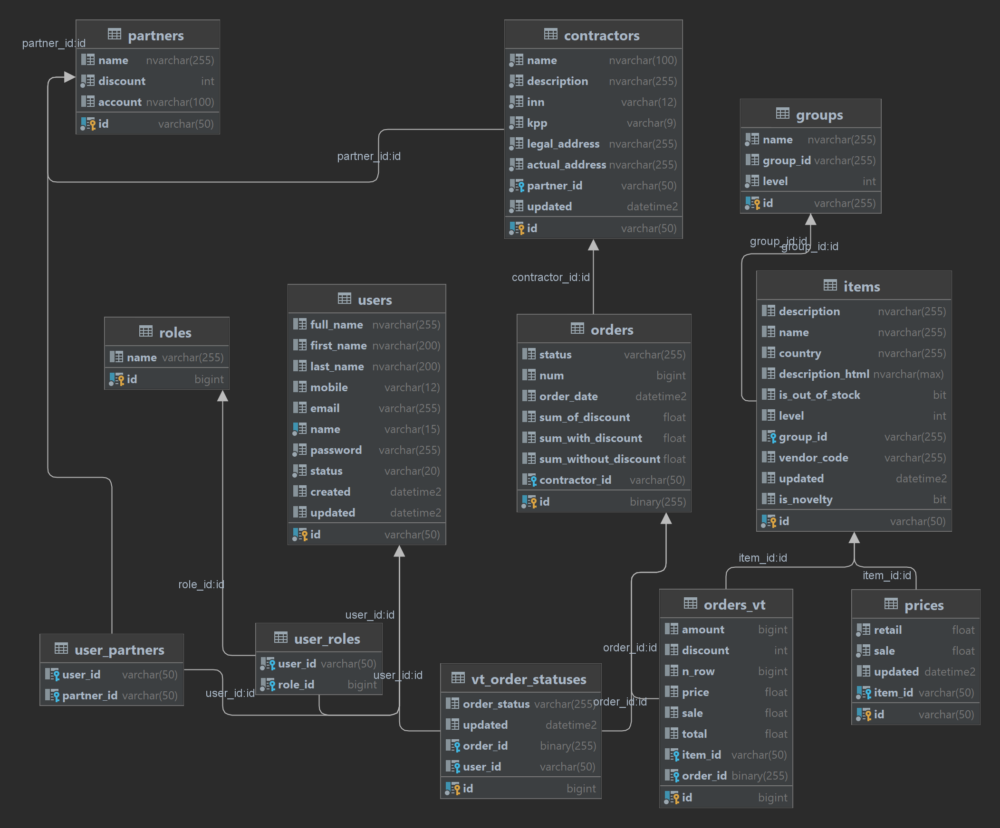

**The "Partner's Personal Account (PC)" application provides the following features**

• user authorization

• user registration

• filling the personal account database

• viewing a list of goods, as well as their prices (they are different for each partner, depending on the discount)

• formation of new orders

• sending orders to the master system

• order status tracking

• sending from the master system of generated printed forms (invoices) to personal account

• downloading by the user of printed forms of documents from the personal account

**API Documentation**
https://lk.planet-nails.ru:8443/swagger-ui/index.html#/

**Database schema**

